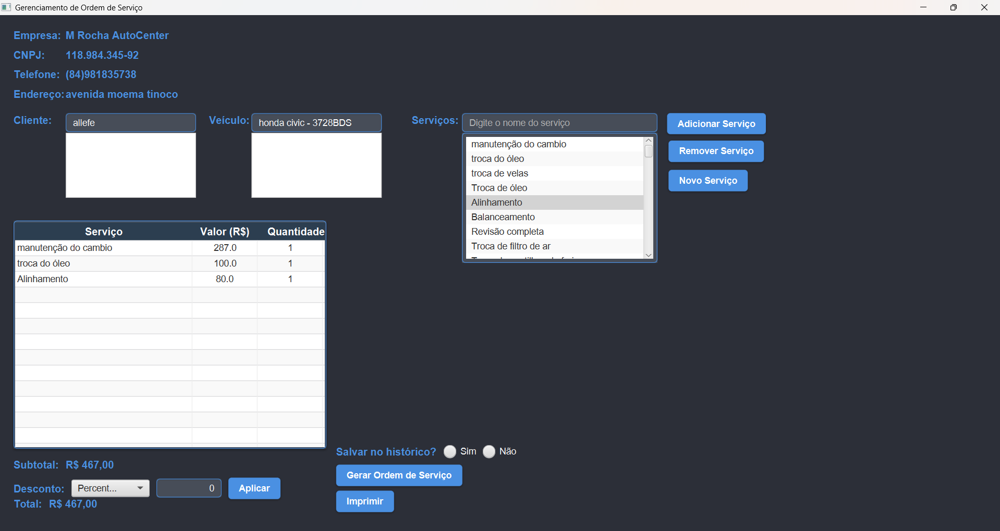
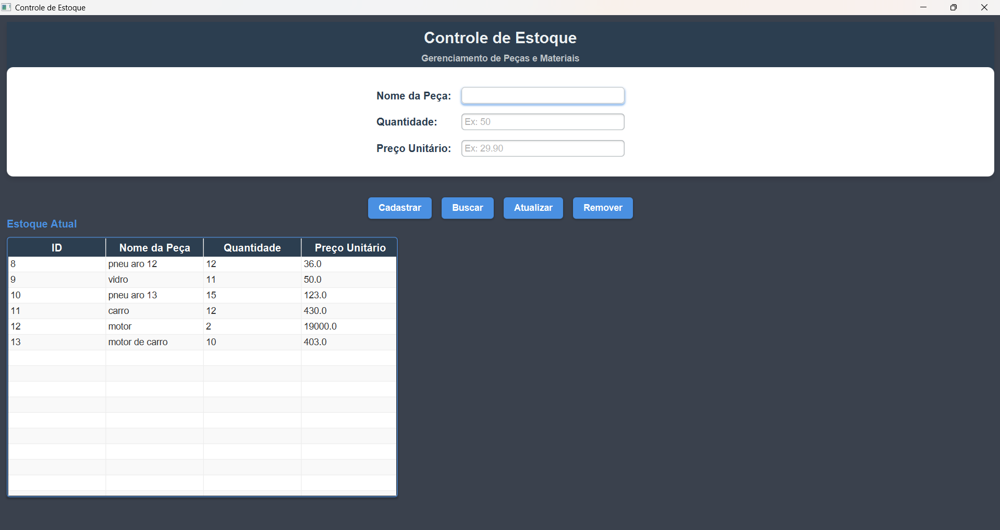
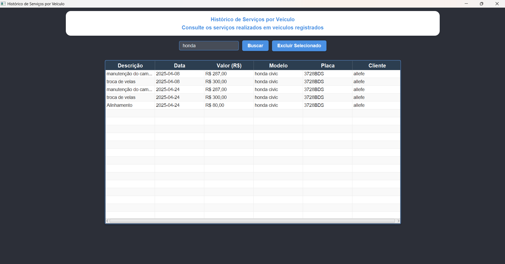
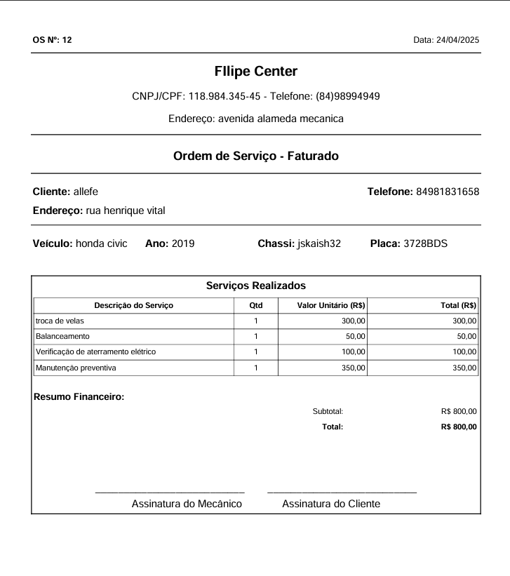

# Sistema de Oficina Mecânica - JavaFX


Sistema desktop completo para gestão de oficinas mecânicas desenvolvido em JavaFX com arquitetura MVC e banco de dados SQLite.

## 📌 Visão Geral

Sistema desenvolvido para automatizar os processos de uma oficina mecânica, incluindo:

- Cadastro de clientes e veículos
- Gestão de ordens de serviço
- Controle de estoque de peças
- Histórico completo de serviços
- Geração de relatórios em PDF

## 🖥️ Telas do Sistema

### Tela Principal


### Ordem de Serviço


### Controle de Estoque


### Histórico de Serviços


### Pdf Ordem de Serviço


## 🚀 Funcionalidades

### Clientes
- Cadastro completo de informações pessoais
- Pesquisa por nome, CPF ou telefone
- Edição e exclusão de registros

### Veículos
- Vinculação automática a clientes
- Registro de modelo, marca, ano e placa
- Histórico de serviços associados

### Ordens de Serviço
- Criação com múltiplos serviços
- Seleção de peças do estoque
- Cálculo automático de valores
- Geração de PDF profissional

### Estoque
- Controle de entrada e saída de peças
- Alertas de baixo estoque
- Atualização automática após serviços

### Histórico
- Filtros por data, cliente ou veículo
- Visualização de ordens anteriores
- Reabertura de serviços

## 🛠️ Tecnologias Utilizadas

- **Linguagem**: Java 21+
- **Interface**: JavaFX 19+ (Scene Builder)
- **Banco de Dados**: SQLite
- **Arquitetura**: MVC (Model-View-Controller)
- **PDF**: iText

## 📦 Pré-requisitos e Instalação

### Requisitos Mínimos
- JDK 21 ou superior
- JavaFX SDK 19+
- SQLite JDBC Driver

### Como Executar
1. Clone o repositório:
```bash
git clone https://github.com/allefe1/Sistema-Oficina-Mecanica.git
cd oficina-mecanica-javafx
